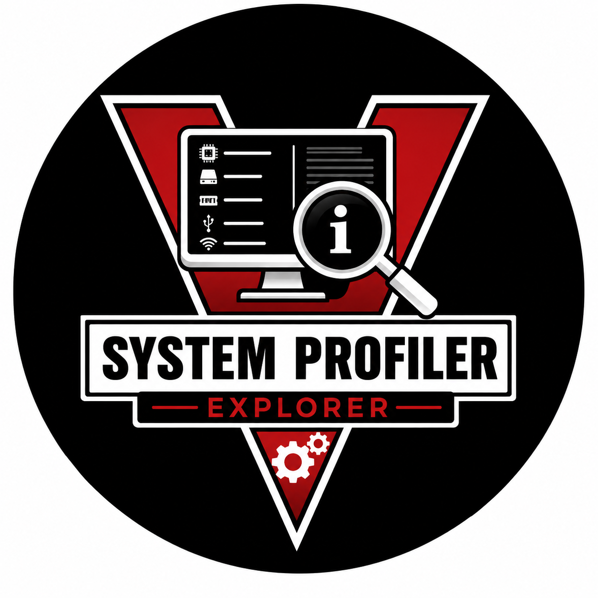
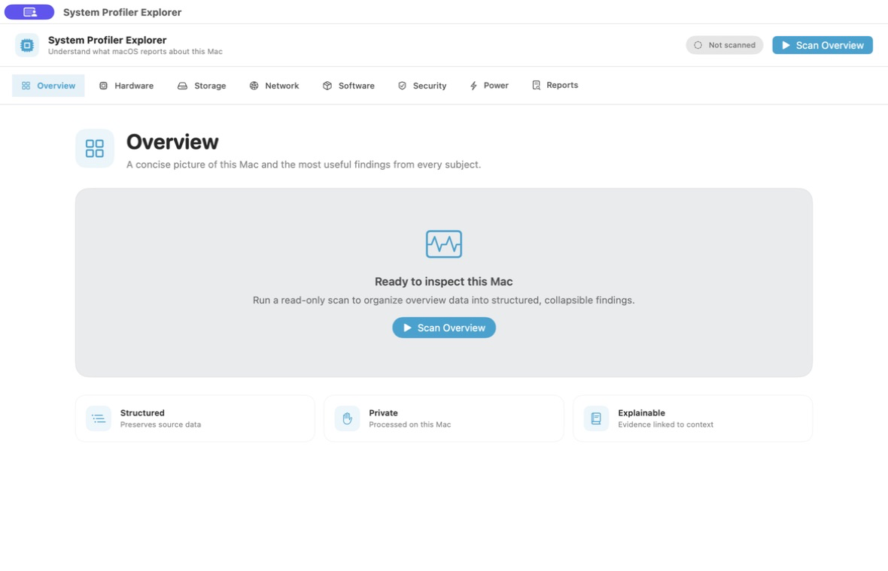
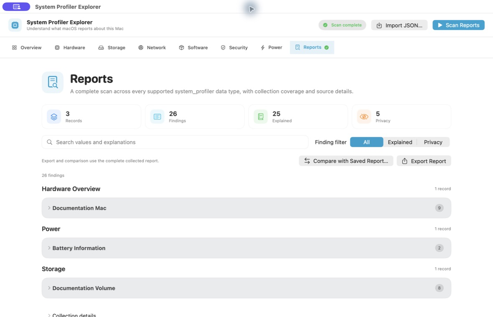
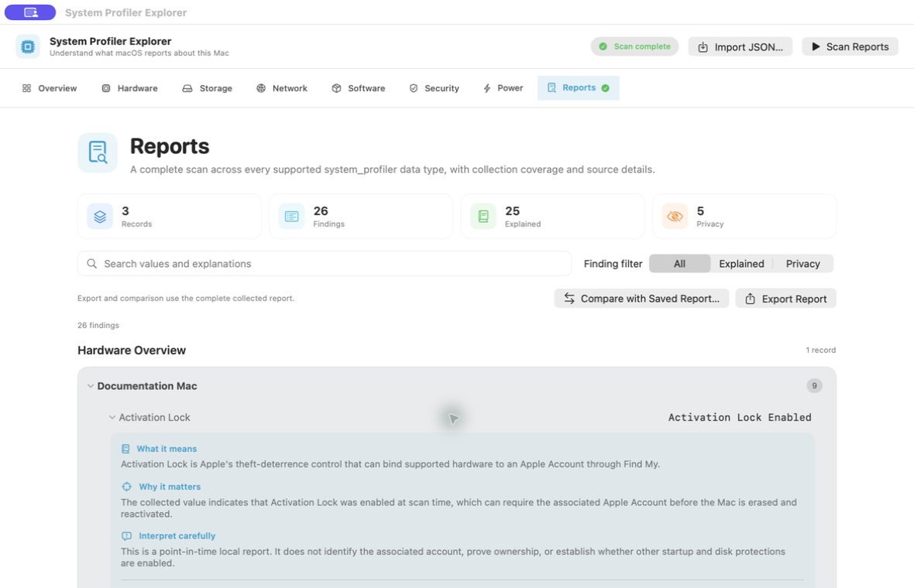

# System Profiler Explorer

<p align="center">
  
</p>

<p align="center">
  A polished, local-first macOS interface for understanding Apple <code>system_profiler</code> reports.
</p>

<p align="center">
  
  
  
  
  
</p>

> [!IMPORTANT]
> System Profiler Explorer reports what macOS returned at scan time. Its explanations add context and interpretation limits, but they do not by themselves diagnose compromise, prove ownership, or replace vendor documentation and professional analysis.

## Contents

- [Overview](#overview)
- [Screenshots](#screenshots)
- [Coverage](#coverage)
- [How it works](#how-it-works)
- [Download v0.1.1](#download-v011)
- [Install and run](#install-and-run)
- [Open the app safely when Gatekeeper intervenes](#open-the-app-safely-when-gatekeeper-intervenes)
- [Use the app](#use-the-app)
- [Build from source](#build-from-source)
- [Privacy and interpretation boundaries](#privacy-and-interpretation-boundaries)
- [Contributing and security](#contributing-and-security)
- [License](#license)

## Overview

System Profiler Explorer is a native SwiftUI application that runs Apple’s read-only `/usr/sbin/system_profiler` utility and turns its structured JSON into organized, searchable findings. Values remain traceable to their original data type and source field while collapsible explanation cards describe:

- what the finding means;
- why the value may matter;
- how to interpret it without overstating the evidence; and
- whether it may expose private or identifying information.

The app can scan this Mac directly or import an existing raw JSON report. Processing stays on the Mac: there is no account, analytics SDK, cloud service, or network upload.

### Current source features

The features below describe the current source on `main`. The downloadable v0.1.1 release predates the collection-health, comparison dashboard, snapshot, review-summary, and diagnostic-log improvements; build from source to use them until a newer release is published.

- All 50 `system_profiler` data types represented by the app’s current macOS toolchain
- Eight readable subject tabs: Overview, Hardware, Storage, Network, Software, Security, Power, and Reports
- Complete Reports scan plus focused, faster subject scans
- Collapsible records and explanations with source provenance
- Search across names, values, fields, and explanations
- Precomputed report indexing and debounced, cancellable search for large inventories
- Explained-only and privacy-sensitive filters
- Section and subject finding badges, recent-search history, source-location links, and persistent bookmarks
- First-class **What Changed?** workspace for saved-report comparison, with added/removed/changed cards, evidence-ranked review groups, and plain-language difference explanations
- **Highlights** workspace for bounded cross-section context: startup disk/encryption, interfaces/network configuration, management profiles, and battery/power settings
- Local named snapshot history with timestamps, full/redacted storage choices, retention controls, and one-click baseline comparison
- A focused Markdown or PDF System Review Summary built from bookmarked findings; raw JSON remains a separate export
- Visible explanation-coverage labels: curated explanation, general data-type context, or unrecognized field
- Compact diagnostic-log rows, background AVE/HEVC pattern summaries, and paged original text with explicit interpretation limits
- Local JSON import, redacted or full export, and saved-report comparison
- Responsive 100-record paging for large software and full-system sections
- Universal application bundle for Apple silicon and Intel Macs

## Screenshots

### Clean subject dashboard



The Overview screen provides a calm starting point for a live full-system scan or a local JSON import.

### Organized full report



The Reports tab groups every collected data type into collapsible records and shows finding, explanation, and privacy counts.

### Detailed finding explanation



Each recognized finding separates meaning, significance, interpretation limits, source information, and privacy guidance. These screenshots were captured from the compiled v0.1.0 app using a synthetic documentation report; they contain no live system inventory or personal identifiers.

## Coverage

The focused tabs organize commonly reviewed findings by subject. Reports is the exhaustive view: it requests every supported data type, preserves sections even when the Mac returns no records, and displays collection coverage rather than silently treating missing data as absence. The separate **Highlights** and **What Changed?** workspaces analyze an already collected report; neither launches a hidden scan nor merges data from different collection times.

For every live scan, each requested data type is marked as **Collected**, **No records**, **Skipped**, **Unavailable**, **Timed out**, or **Permission-limited**. **No records** means `system_profiler` returned an empty section. **Unavailable**, **Timed out**, and **Permission-limited** are shown only when matching diagnostic text supports that scan-level label; otherwise the app records a missing JSON section as **Skipped** instead of guessing a cause. Use **View Incomplete Collection** in the Collection coverage card to inspect every incomplete data type and the diagnostic output from `system_profiler`. Imported JSON does not preserve its original command scope, so it reports only the data types present in that source file.

| Tab | Purpose |
| --- | --- |
| Overview | Launch a full scan, import a report, and review app capabilities and privacy boundaries. |
| Hardware | Hardware overview, memory, displays, buses, cameras, audio, controllers, and attached devices. |
| Storage | Storage volumes and interfaces including NVMe, SATA, SAS, Fibre Channel, and network volumes. |
| Network | Interfaces, Wi-Fi, Ethernet, Bluetooth, locations, addresses, and active configurations. |
| Software | macOS/software overview, applications, frameworks, extensions, fonts, install history, tools, profiles, and related inventories. |
| Security | Security-related profiler sections and fields, including firewall, secure element, smart cards, configuration profiles, and relevant system state. |
| Power | Battery, charger, power settings, and power-condition findings. |
| Reports | Complete scan across all 50 supported `system_profiler` data types, including legacy or hardware-dependent sections. |

The exact sections and fields returned vary by macOS version, Mac model, attached hardware, permissions, and installed software. An empty section means only that the command returned no records for that section during that collection.

## How it works

```text
Live scan on this Mac                     Existing JSON report
/usr/sbin/system_profiler                 system_profiler -json
          │                                        │
          └──────────────────┬─────────────────────┘
                             ▼
                Validated recursive JSON parser
                             │
                             ▼
           Stable subject and data-type organization
                             │
              ┌──────────────┴──────────────┐
              ▼                             ▼
     Collapsible findings          Offline explanations
     and source fields             and privacy guidance
              │                             │
              └──────────────┬──────────────┘
                             ▼
       Search, bookmark, snapshot, export, and compare
```

The parser preserves structured values instead of flattening away their source context. Exact field explanations are used where the schema is known; careful data-type context is used for changing or hardware-specific schemas. Unknown fields remain visible and are labeled as unrecognized rather than assigned an invented meaning.

## Download v0.1.1

Download the universal macOS build from [Releases v0.1.1](https://github.com/hideouts-io/SystemProfilerExplorer/releases/tag/v0.1.1):

- [SystemProfilerExplorer-0.1.1-macOS-universal.zip](https://github.com/hideouts-io/SystemProfilerExplorer/releases/download/v0.1.1/SystemProfilerExplorer-0.1.1-macOS-universal.zip)
- [SHA-256 checksum](https://github.com/hideouts-io/SystemProfilerExplorer/releases/download/v0.1.1/SystemProfilerExplorer-0.1.1-macOS-universal.zip.sha256)

The bundle supports macOS 13 or later on Apple silicon and Intel Macs. Version 0.1.1 is ad hoc signed and is not Apple-notarized, so Gatekeeper may require a one-time approval after download.

## Install and run

1. Download both the ZIP and checksum file from the v0.1.1 release.
2. In Terminal, change to the download directory and verify the archive:

   ```sh
   shasum -a 256 -c SystemProfilerExplorer-0.1.1-macOS-universal.zip.sha256
   ```

   Continue only if the result ends with `OK`.

3. Double-click the ZIP, then move `SystemProfilerExplorer.app` to the Applications folder.
4. Open the app. Select a subject and choose its scan button, or choose **Scan Reports** for complete coverage.

No administrator password is required to run the app. Some profiler sections can still be unavailable because of macOS permissions or hardware support; the app reports collection failures instead of hiding them.

## Open the app safely when Gatekeeper intervenes

Because v0.1.1 is not notarized, macOS may say that Apple cannot check it for malicious software or that the developer cannot be verified. First verify the SHA-256 checksum above. Then use one of Apple’s one-app approval paths:

- In Finder, Control-click `SystemProfilerExplorer.app`, choose **Open**, then confirm **Open**; or
- Try to open the app once, open **System Settings → Privacy & Security**, and choose **Open Anyway** for System Profiler Explorer.

The approval is specific to this app. Do not globally disable Gatekeeper, and do not enter commands that remove protections system-wide. Apple documents the same review-and-open workflow in [Safely open apps on your Mac](https://support.apple.com/guide/mac-help/open-a-mac-app-from-an-unidentified-developer-mh40616/mac).

## Use the app

### Scan this Mac

Choose a subject tab and start its focused scan, or choose **Scan Reports** to run a complete scan. `system_profiler` can take several minutes for large software inventories; progress remains visible while it runs.

### Import raw `system_profiler` JSON

Create a complete report outside the app when needed:

```sh
/usr/sbin/system_profiler -json -detailLevel full > full_report.json
```

Open System Profiler Explorer, choose **Import JSON…**, and select the file. The import is validated and read locally without modifying the source file or retaining its path in the displayed report.

### Search and filter

Search matches displayed values, source fields, record names, and explanation text. Use **Explained** to focus on interpreted fields or **Privacy** to review values that deserve care before sharing. The recent-search menu keeps the last eight searched terms. Section headings and subject tabs show finding counts, making large reports easier to triage.

### Bookmark and trace a finding

Use the bookmark button beside a finding to include it in a focused review. **Open Bookmark** takes you directly back to a saved source field, while **Show Raw Source Location** filters to and highlights the underlying `system_profiler` field. Array-shaped paths use `[]` to identify the raw field schema; record context remains visible in the surrounding disclosure.

Every finding also labels the scope of its explanation:

- **Curated explanation** is a maintained field-specific entry in the app’s catalog.
- **General data-type context** is careful context for an evolving or hardware-specific section, rather than a claim that Apple’s exact field schema is known.
- **Unrecognized field** preserves the reported value without an invented interpretation.

### Understand diagnostic logs

Expand **Diagnostic Log Contents** to review recognized AVE/HEVC encoder patterns. The summary separates observed log counts and process labels from possible image-processing explanations and facts the excerpt cannot establish. Process labels are not signature verification; encoding does not by itself establish recording or transmission. Explanation badges describe coverage, not a safety verdict.

Analysis is limited to the first two million characters and explicitly labels partial results. **View original log text** preserves the entire field in 12,000-character pages. Unsupported patterns remain available without an invented diagnosis. Logs can include private paths and attachment names; review them before sharing.

### Save a local snapshot

Choose **Snapshots** in any collected report to save a named baseline. A **Full values** snapshot stays local and enables one-click comparison with the currently open report. A **Redacted values** snapshot replaces scalar values before storage and is intentionally not comparable. Choose a retention policy of 5, 10, 25, or all snapshots; the app removes the oldest local snapshots beyond that limit.

Snapshots are stored under this Mac’s Application Support directory, never in the repository or a cloud account. Treat full snapshots as sensitive system inventory.

### Review Highlights

Choose **Highlights** to inspect relationships inside one collected report. The app can connect startup-disk fields with FileVault/encryption fields, interfaces with VPN/proxy/DNS configuration, profiles with management indicators, and battery-health fields with power settings. Every card exposes its raw source fields and an interpretation limit. A configured VPN, profile, or encryption field is configuration evidence; it does not prove traffic, control, user activity, or compromise.

### Export and compare

The export review offers two explicit choices:

- **Redacted report** replaces every reported scalar and record name, omits exact collection times, and removes standard-error text.
- **Full private report** preserves exact values and metadata for private analysis and future comparison.

A current scan can be compared with a compatible full report created from the same subject or full-report scope. Named records are matched independently of order; unnamed records and array elements are matched by position. Added, removed, and changed values identify structured differences, not their cause or security impact.

The **What Changed?** tab makes this comparison a primary workspace. It accepts a full private saved report, then presents clear added, removed, and changed totals. Differences are grouped as **Review First**, **Worth Reviewing**, or **Informational** to guide triage—not to assign a threat level. Expand a difference for its baseline/current values, raw source location, and a plain-language explanation grounded in the app’s explanation catalog.

For a polished, focused document, bookmark the findings to include and choose **Review Summary**. The app exports Markdown or PDF containing only those selected findings, their source locations and explanation-coverage labels, collection limits (including skipped sections), and an explicit privacy warning. It never folds raw JSON into this summary; use **Export Report** separately when raw evidence is required.

## Build from source

Requirements:

- macOS 14 or later for development
- Xcode 26 or a compatible Swift 6 toolchain
- [XcodeGen](https://github.com/yonaskolb/XcodeGen) only after changing `project.yml`

Clone and open the checked-in Xcode project:

```sh
git clone https://github.com/hideouts-io/SystemProfilerExplorer.git
cd SystemProfilerExplorer
open SystemProfilerExplorer.xcodeproj
```

Run the publication safeguard and test suite from Terminal:

```sh
./scripts/check-publication-boundary.sh

xcodebuild -project SystemProfilerExplorer.xcodeproj \
  -scheme SystemProfilerExplorer \
  -destination 'platform=macOS' \
  build test
```

Build the same universal ZIP and checksum layout used by the v0.1.1 release:

```sh
./scripts/build-release.sh
```

Generated assets are written under the ignored `dist/` directory. The script verifies the app metadata, strict code-signature integrity, `arm64` and `x86_64` slices, minimum macOS version, and SHA-256 manifest. It produces an ad hoc signed development distribution; Developer ID signing and Apple notarization require the maintainer’s Apple Developer credentials and are not simulated by the script.

In Codex, the local **Run** action uses `script/build_and_run.sh` to build, ad hoc sign, and open a Debug app without requiring an Apple Developer certificate.

## Privacy and interpretation boundaries

`system_profiler` can reveal serial numbers, hardware UUIDs, device identifiers, user names, local paths, network addresses, installed applications, timestamps, and other host fingerprints. Treat a full report as private system inventory.

- Collection and analysis remain local unless you explicitly export or share a file.
- Raw reports, snapshots, Xcode user state, and generated report files are ignored by Git.
- A publication-boundary script rejects known report formats, user-specific absolute paths, and private-key material before release builds.
- Screenshots and bug reports must use synthetic or thoroughly sanitized data.
- A profiler value proves only what the local command reported at that moment. It does not prove account ownership, remote activity, malicious intent, or compromise.

Do not attach raw output to a public issue. If a private report is essential to a security report, first arrange an approved private transfer method with the maintainer.

## Project structure

```text
SystemProfilerExplorer/
├── SystemProfilerExplorer/          SwiftUI app, collection, parsing, and explanations
├── SystemProfilerExplorerTests/     Behavior, integration, import, export, and coverage tests
├── docs/images/                     Sanitized README screenshots
├── script/                          Local Codex build-and-run action
├── scripts/                         Publication and universal-release checks
├── SystemProfilerExplorer.xcodeproj Checked-in Xcode project
├── LICENSE                           MIT open-source license
└── project.yml                      XcodeGen project source
```

## Contributing and security

Before proposing a change, read [CONTRIBUTING.md](CONTRIBUTING.md) for development, interpretation, testing, and fixture rules. Report security problems using the private process in [SECURITY.md](SECURITY.md), never with an unredacted profiler report in a public issue.

## License

System Profiler Explorer is open-source software released under the [MIT License](LICENSE). You may use, copy, modify, distribute, sublicense, and sell the software, including for commercial purposes, as long as copies or substantial portions retain the copyright and license notice. The software is provided without warranty.
